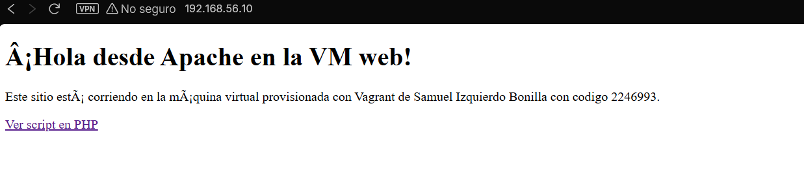
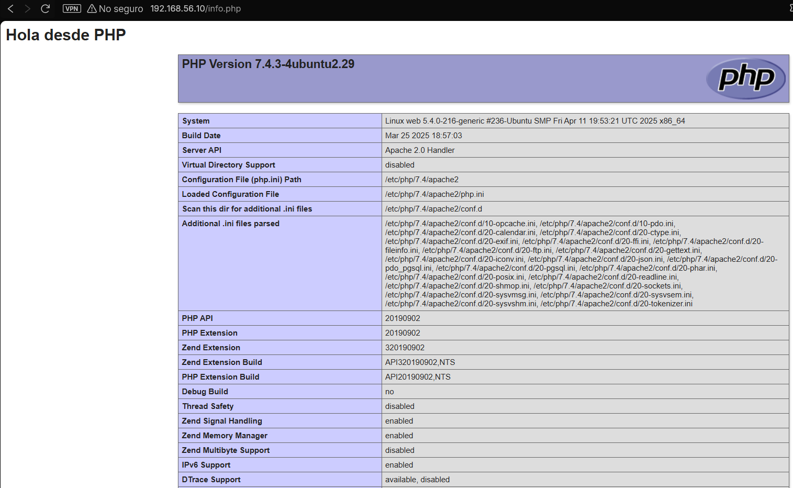
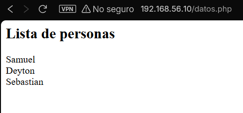

# Taller autoguiado: Vagrant con provisionamiento mediante Shell

## 📖 Tabla de Contenidos
1. [Descripción del proyecto](#descripción-del-proyecto)
2. [Objetivo](#objetivo)
3. [Características principales](#características-principales)
4. [Instalación](#instalación)
5. [Uso](#uso)
6. [Provisionamiento](#provisionamiento)
7. [Reto](#reto)
8. [Contacto](#contacto)
9. [Tecnologías Usadas](#tecnologías-usadas)
10. [Ejemplos Visuales](#ejemplos-visuales)

---

## Descripción del proyecto
Este taller permite aprender a crear y configurar máquinas virtuales utilizando **Vagrant** con provisionamiento mediante **Shell scripts** para instalar servicios y desplegar una aplicación web básica.

## Objetivo
El objetivo es entender cómo automatizar la configuración de entornos de desarrollo virtualizados con **Vagrant** y **Bash**, implementando un servidor web y una base de datos conectada a una aplicación PHP.

## Características principales
- Configuración automática de máquinas virtuales con Vagrant.
- Provisionamiento mediante scripts de Shell.
- Instalación de **Apache**, **PHP** y **PostgreSQL**.
- Conexión entre un sitio web en PHP y una base de datos PostgreSQL.
- Ejemplo funcional accesible desde el navegador del host.

---

## Instalación

### 1. Clonar el Repositorio
```bash
git clone https://github.com/ZantaCruz/vagrant-web-provisioning.git
cd vagrant-web-provisioning
```

### 2. Iniciar las Máquinas Virtuales
```bash
vagrant up
```

Esto creará dos máquinas virtuales:

- **web** → Servidor web con Apache y PHP.
- **db** → Servidor de base de datos PostgreSQL.

### 3. Verificar la Configuración
Accede a las IPs privadas definidas en el archivo `Vagrantfile` (por ejemplo, `http://192.168.56.10` para la web).

---

## Uso

1. Abre tu navegador y visita:
   ```
   http://192.168.56.10/index.html
   http://192.168.56.10/info.php
   http://192.168.56.10/datos.php
   ```
2. El archivo `info.php` muestra información de PHP.
3. El archivo `datos.php` se conecta a PostgreSQL y muestra registros desde la base de datos configurada en la VM `db`.

---

## Provisionamiento

### provision-web.sh
Instala y configura el servidor web con Apache y PHP.

### provision-db.sh
Instala y configura PostgreSQL, crea la base de datos y carga datos de ejemplo.

Ejemplo de conexión desde PHP:
```php
$conn = pg_connect("host=192.168.56.11 dbname=mi_base user=mi_usuario password=mi_contraseña");
$result = pg_query($conn, "SELECT * FROM ejemplo;");
while ($row = pg_fetch_assoc($result)) {
    echo $row['nombre'] . "<br>";
}
```

---

## Reto
1. Provisionar la máquina `db` con PostgreSQL.
2. Crear una base de datos y una tabla con datos de ejemplo.
3. Conectar la aplicación PHP con la base de datos.
4. Documentar el proceso con capturas y scripts en el README.


## Contacto
**Autor:** Samuel Izquierdo  
**Correo:** [samuelizquierdo98@gmail.com]  
**GitHub:** [https://github.com/ZantaCruz](https://github.com/ZantaCruz)

---

## Tecnologías Usadas
- Vagrant
- Bash / Shell
- Apache
- PHP
- PostgreSQL
- VirtualBox

---

## Ejemplos Visuales
A continuación se muestran capturas de la aplicación funcionando correctamente en las máquinas virtuales:





